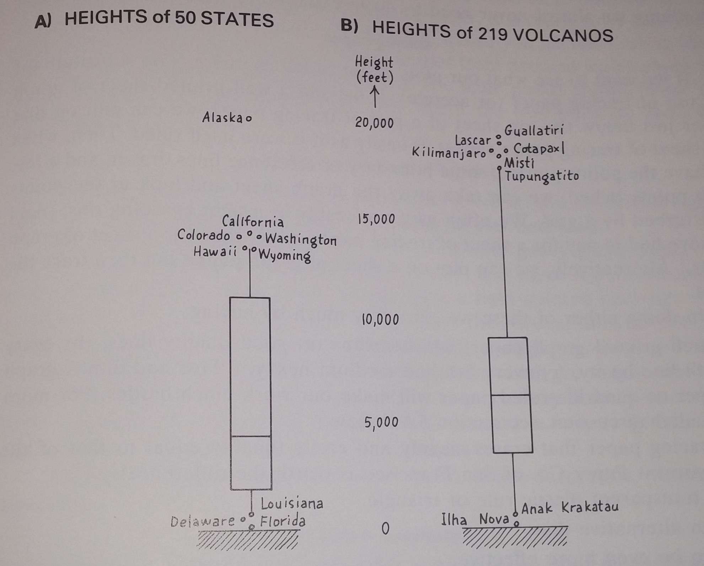
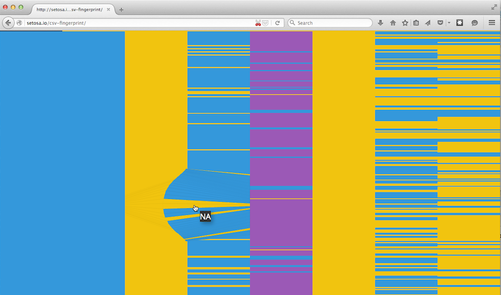

```{r, echo=FALSE}
library(knitr)
opts_knit$set(animation.fun = hook_scianimator, cache=TRUE)
knit_hooks$set(custom_plot = hook_plot_custom)
knitr::opts_chunk$set(warning=FALSE, message=FALSE)
```


## "Big" thoughts

Big data is a subset of multidimensional data. Both contribute (but neither is _necessary_) to the degree of  story-worthiness of your dataset.

Some of the best and most useful data vizualizations are ones that we make for ourselves


## John Tukey
<div class="columns-2">
> "The greatest value of a picture is when it forces us to notice what we never expected to see." - John Tukey, 1977

<div class="centered"></div>
</div>


## Example: boxplots
<div class="centered"></div>


## Data for this talk
```{r loaddata}
library(NHANES)
data(NHANES)
set.seed(123) ## why set the seed?
str(NHANES)
```

## Modified data
```{r mutate-data}
library(dplyr)
NHANES_ltd <- select(NHANES[sample(nrow(NHANES), 500),],  ## subset for lighter-weight figures
                     Age, Gender, Education, HHIncomeMid, Height, BMI_WHO, SexAge, AgeFirstMarij) %>%
  mutate(Education = as.ordered(Education),
         BMI_WHO = as.ordered(BMI_WHO))
str(NHANES_ltd)
```


## outline

Multivariate plots

 - CSV fingerprint
 - pairs plots options
 - Table plot
 - Parallel plots
 
Lower-variate plots

 - Faceting
 - Heat maps, contour plots
 - Graphical inference
 - scatter plots with smooths, marginal histograms, 

# Overview of your data

## CSV fingerprint
Powell, V. CSV Fingerpint. [http://setosa.io/csv-fingerprint/](http://setosa.io/csv-fingerprint/)

<div class="centered">
</div>


# Standard pairs plot / scatterplot matrix

----
```{r pairsplot, out.height="550", fig.align="center"}
plot(NHANES_ltd)
```

----
```{r subpairsplot, warning=FALSE, message=FALSE, fig.align="center"}
select(NHANES_ltd, Age, Height, SexAge, AgeFirstMarij) %>% 
  pairs()
```

# Generalized pairs plot


## Generalized pairs plot
The pairs plot is useful on its own, but the generalized pairs plot is even better.

Emerson, J. W., Green, W. A., Schloerke, B., Crowley, J., Cook, D., Hofmann, H., and Wickham, H. (2013). The generalized pairs plot. Journal of Computational and Graphical Statistics, 22(1):79–91. 

[http://bit.ly/gpairs](http://bit.ly/gpairs)

----
```{r ggally-pairsplot3, message=FALSE, fig.width=15, fig.height=9, dpi = 50, fig.align="center"}
library(ggplot2)
library(GGally)
print(select(NHANES_ltd, Age, Gender, Height, SexAge, AgeFirstMarij) %>% 
  ggpairs())
```


# Tableplots

## Tableplots
Tennekes, M., de Jonge, E., and Daas, P. J., H. (2013). Visualizing and inspecting large datasets with tableplots. Journal of Data Science, 11(2013):43-58. 
[http://bit.ly/tabplot](http://bit.ly/tabplot)

----
```{r tabplot1}
library(tabplot)
NHANES_ltd2 <- select(NHANES, 
                     Age, Education, HHIncomeMid, Height, BMI_WHO, SexAge, AgeFirstMarij) %>%
  mutate(Education = as.ordered(Education),
         BMI_WHO = as.ordered(BMI_WHO))
tableplot(NHANES_ltd2, sortCol=Age)
```

----
```{r tabplot2}
tableplot(NHANES_ltd2, sortCol=BMI_WHO)
```

----
```{r tabplot3}
tableplot(NHANES_ltd2, sortCol=Education)
```


# Graphical inference

## Graphical inference
Wickham, H., Cook, D., Hofmann, H., and Buja, A. (2010). Graphical inference for infovis. IEEE Transactions on Visualization and Computer Graphics, 16(6).

[http://bit.ly/graphical_inference](http://bit.ly/graphical_inference)


----

Do college grads become sexually active later compared with individuals similar individuals with less than a college education?

> Can you see the difference?

----
```{r inference, message=TRUE, fig.width=15, fig.height=8, dpi = 50, fig.align='center'}
library(nullabor)
qplot(Education, SexAge, data=NHANES_ltd) %+% lineup(null_permute('SexAge'), NHANES_ltd) +
  facet_wrap(~.sample) + geom_boxplot() + theme(axis.text.x  = element_text(angle=90, vjust=0.5))
```

----
```{r answers}
decrypt("OlCE bQTQ Aw GWPATAWw vr")
```

